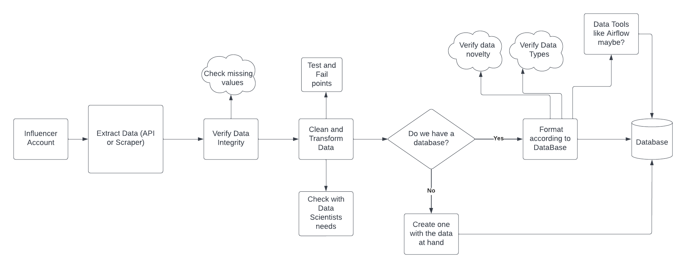

# Answers to Theoretcial Questions

[Theoretical Questions](#theoritcal-answers)

# Get Started

First clone this repo

```git clone https://github.com/Iuryck/1nfluencersMarketing-TwitterScraper.git```

Install dependencies, maybe create an environment before hand

```pip install -r requirements.txt```

Then just insert your credentials in the `config.json` file and you are all set!

Note that you have to put your phone number or username in the `username_or_phonenumber` variable, because you might be prompt with a page about suspicious activity on the twitter login page.


# Requirements

You will need Google Chrome installed

Libraries can be found in requirements.txt file


async-generator==1.10
attrs==22.1.0
beautifulsoup4==4.11.1
bs4==0.0.1
cffi==1.15.1
charset-normalizer==2.1.0
colorama==0.4.5
cryptography==37.0.4
h11==0.13.0
idna==3.3
numpy==1.23.2
outcome==1.2.0
pandas==1.4.3
pycparser==2.21
pyOpenSSL==22.0.0
PySocks==1.7.1
python-dateutil==2.8.2
python-dotenv==0.20.0
pytz==2022.2.1
requests==2.28.1
selenium==4.4.0
six==1.16.0
sniffio==1.2.0
sortedcontainers==2.4.0
soupsieve==2.3.2.post1
tqdm==4.64.0
trio==0.21.0
trio-websocket==0.9.2
urllib3==1.26.11
webdriver-manager==3.8.3
wincertstore==0.2
wsproto==1.1.0


# Theoretical Answers

## Question 1
*Describe which are the main challenges to implement a scraper in social media platforms such as Instagram, YouTube and TikTok. Give at least 4 examples of challenges, explain why you believe that is an issue and present which methods you would use to handle it. If you believe there are some challenges that cannot be solved, please provide the reason to support your point of view.*

Big tech companies such as Facebook try to protect their platforms and maintain a healthy and normal community within their vision of the social media platforms, they also try to maintain all of the useful data the platforms generate to themselves or at least maintain control of it (twitter API for example). And Webscraping is a threat to those 2 principles, like the scandal of robots on social media platforms to manipulate and drive popular opinion in presidential elections. These platforms do not want this happening. And thus they do everything to make it impossible for webscrapers and webcrawlers to use their platforms.

They do this with:

- Captchas: one of the biggest enemies to webscrapers, it's not impossible by any means, but the fact that they are on the website already makes the process slow, clunky, and somewhat unreliable. Normally resolved with AI or 3rd party services.

- Dynamic Pages: pages that generate themselves on the fly with JavaScript, these pages will hide the website code/data behind scripts that only activate on certain conditions. They can be dealt with by using WebDrivers and Selenium, but if a website really wants to avoid webscrapers it can be very difficult to do certain tasks.

- Limiters: Scripts that detect and limit user interactions on the website, for example, if someone clicks a button 50 times in a span of a second, the website may stop responding to the clicks, or just block the IP adress entirely. The way to deal with this is to avoid triggering such scripts in the first place, because after they are triggered it can be very difficult or just impossible to overcome.

- WebScraping Detectors: These I will be honest that I don't know much on how they work or how to avoid them, normally it changes from website to website. Some websites will block your IP adress as soon as you click a button with Selenium, others will detect it more based on how many interactions you are doing. Probably it's some reverse engineering on famous libraries like Selenium, or maybe it's AI, but some websites are very good at detecting scrapers and it might just be impossible to scrape such websites. Note that I am talking about an avid detector, like an agent of sorts, not just a simple script like a limiter.

## Question 2
*What do you understand about Data Mining? How this concept can be used in the mission to develop a platform that supports business to find the best Influencer to increase the ROI of their marketing actions.*

Data Mining is the concept of extracting useful information from raw data, this is done with all sorts of statistical tools from data visualization to machine learning. 
The way this helps such platform is by detecting patterns on the user base of such influencers, just like Marketing companies do. An influencer has a target audience with their respective profiles and data patterns, just like a product. Age range, specific market like Kitchen or Kids toys, or even gender like a male target audience. If you have a product with the same target audience an influencer has, then it's a match, most likely an Ad campaign with that influencer will be profitable. It also helps to identify how many people will see that ad.

## Question 3
*Web scraping tasks. If you already use some of them, please describe the solution you have created.*

Once I wanted to extract data from the brazillian stock info website called Fundamentus, most of the data was in html tables so it was easy to retrieve with Selenium and Pandas, just needed some cleaning and formatting. But there were some excel files on company historical data that I really wanted to extract, but they were protected by Captcha. I had to train a Deep Learning model to be able to solve the captchas and download the data, using Tensorflow and Keras. In the end I did make a full webscraper of the site, you can find it pinned on my github page https://github.com/Iuryck/Fundamentus_Scrape.

## Question 4
*Explain what HTTP is and how it works. Also, provide a brief description of methods, headers, and cookies in the HTTP context.*

HTTP is a data transfer protocol, specifically a HyperText Transfer Protocol. Contrair to popular knowledge it is much more then just a way to send website data and view it. As a data transfer protocol you can request and send data through http urls, alot of APIs and Servers function like this. It works with a client asking for certain data, this is called a *request*, what the server responds to that request is called a *response*. 

- HTTP Cookies are some data that the server can send to the client, this data is then stored and used the next time the client makes a request. This has many uses such as keeping track of a login sessions.

- HTTP Headers: permits the client to send specific data through a request, APIs for example normally need a token or a login so the server validates a request, these normally go through headers.

- HTTP Functions: like normal programming functions, they exist to do certain actions. In HTTP context it's to send a specific type of request, that will do different things. GET is a request function to retrieve data from the server, mostly harmless. POST is to send data, which can be harmful.

## Question 5 
*What do you understand about Proxies Servers and why they're important for the web scraping process?*

Proxy servers, as of my understanding, serve to reallocate your computer IP adress to another one, in a way. It does this by making requests on your behalf on a server with different IP adress, and sending the responses to your computer. The importance of this in WebScraping is that data and websites might be blocked or restricted by region and country. Proxy servers can overcome that problem, although it may cost on performance.

## Question 6 
*Differentiate Machine Learning, artificial intelligence, and data science.*

Machine Learning is a type of Artificial Intelligence in midst of many, just like grape is a type of Fruit. Machine Learning is specifically a type of Artificial Intelligence that learns from acting on data through numerous iterations, with a goal that it must achieve on every iteration, and an error from the goal that it has to make smaller and smaller through each iteration. At one point the algorithm will reach a limit where it can learn no more, thus we say it learned or optimized.

Data Science is a field about analyzing data and extracting useful information from it, or making a product out of it. It is some what equal to data analyst, but much more *cooler*. Using alot of complex math, algorithms, and Artificial Intelligence models to do such task, rather than using normal statistics and visualization. It's sort of a step above a data analyst.

## Question 7
*In the Machine Learning context, what is Feature Engineering? Why is this important for Machine Learning Processing and how does Data Engineering come to interfere with that?*

First, features are what we call the data that is fed to an AI model, each data type or column, for example Age or Country_Residing, is a feature for an AI model. Feature Engineering is the task of enhancing the data to better understand the data and improve our AI model. In stocks for example, monthly or weekly trailing data and variations are features made from feature engineering. Data Engineers role in this is to support Data Scientists by doing such feature engineering or make it possible for the scientist themselves to do so by maintaining a good and clean database, datawarehouse, pipeline, etc.

## Question 8
*Differentiate the Data Scientist from the Data Engineering?*

Data Engineers do the work of extracting, cleaning, transforming and loading the data to some storage type (DataLakes, DataMarts, Databases, etc) so that Data Scientists can use the data for their analysis. Imagining data as water, data engineers do the treatment and distribution, while data scientists use the water for daily tasks.


## Question 9
Imagine that you have been hired as a web scraper developer. On your first day
of work you are asked to start a process to develop a data pipeline to create and
update an influencers Database from Instagram. As a first step in this process,
you are asked to create a simplified logic flowchart that shows the steps in the
process of creating this pipeline.




